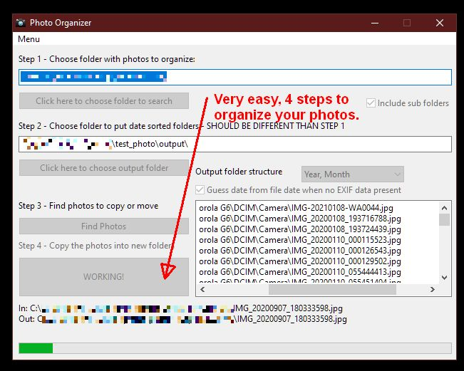
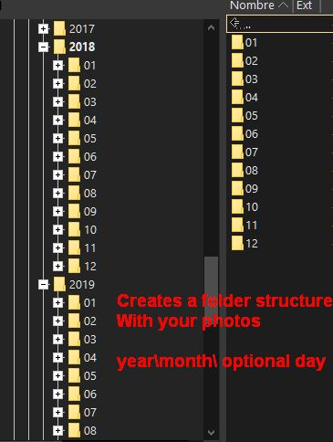

# Photo Organizer

Photo organizer for your local photo backups. 

Move photos to month and day folders according to their EXIF data.

Automatically find the original date taken of their photos and then move and sort the photos into folders based on that date.

When you download your photos to your computer the file date is not necessarily the same as the date you took the photo. 

If you have a large number of files on your memory card or hard drive with photos taken over many different days it can be a mess to try to organize the photos.

# License 

[Read the license to use here.](LICENSE.md)

# Who am I?

Software developer and Computer Science graduate.

Check my portfolio for more info:

https://alvarogonzalezferrer.github.io/

There you can see my portfolio, I'm a freelancer, you can hire me for your projects!

# About the software

## Usage

**TODO** write this section

## Compiling

You need Lazarus: https://www.lazarus-ide.org/

Also **exiftool.exe** is required to be in the same directory as the compiled exe you make with Lazarus.

## Exiftool 

We use this tool to get the proper EXIF date from your JPEG and MP4 files.

Get it from https://exiftool.org/

## Pascal is not dead

This software was done using Free Pascal IDE, Lazarus.

Lazarus is a Delphi compatible cross-platform IDE for Rapid Application Development. It has variety of components ready for use and a graphical form designer to easily create complex graphical user interfaces.

You can create your own open source or commercial applications. With Lazarus you can create file browsers, image viewers, database applications, graphics editing software, games, 3D software, medical analysis software or any other type of software.